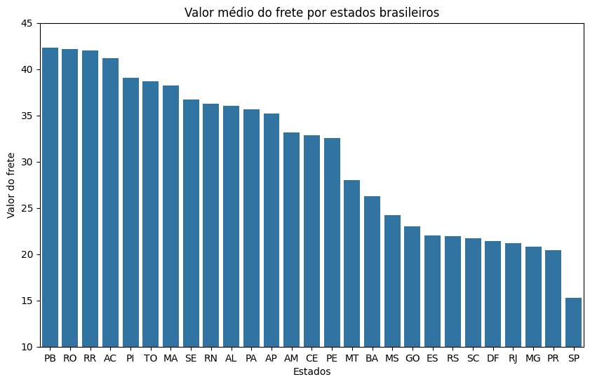
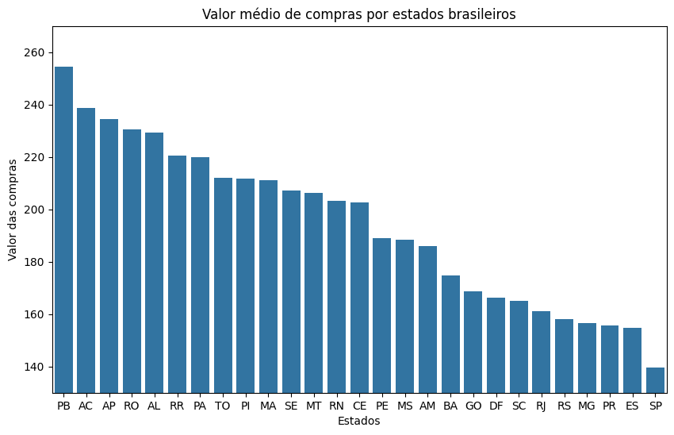
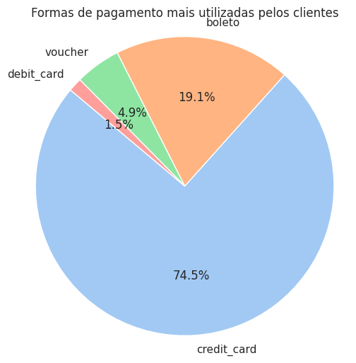

**RELATÓRIO DA ANÁLISE**

**Qual a média de valor de frete? Qual desvio padrão? Qual foi o frete mais caro? E o mais barato?**

* Na tabela, podemos ver que os valores dos preços de frete estão entre 13,18 a 21,26 reais, e a média de 20,14 reais no Brasil inteiro. Porém, o desvio padrão é de 15,83, o que significa que há uma variação considerável nos valores de frete, com o frete máximo de 409,68 reais.
* No gráfico abaixo, podemos entender melhor essa variação no valor do frete levando em consideração a localidade por estado do consumidor. Os estados da região do Norte e Nordeste aparecem com os valores mais elevados de frete, sendo o estado de Paraíba com a média mais alta, ultrapassando o valor de 40 reais de frete. Rondônia, Roraima e o Acre seguem respectivamente próximo a média do primeiro. Bahia é o estado do Nordeste com a média mais baixa da região, seu valor de frete varia entre 25 a 30 reais.
* Os estados do Sul, Sudeste e Centro-Oeste tem seus valores de frete mais baixos, variando entre 20 a 25 reais.
* Somente o estado de São Paulo tem sua média de frete entre os 10 a 15 reais, valor bem abaixo em relação aos outras regiões brasileiras.

**Qual o valor médio das compras? Qual foi a maior compra e qual foi a menor? Qual o desvio padrão?**

* Os valores dos pagamentos variam entre 57.88 reais a 174.90 reais, e sua média é de 156.27 reais por todo país. O desvio padrão é de 216.36, o que significa que sua variação é extremamente alta e por isso essa média não representa o consumidor, e seu valor máximo de 13.664,08 indica a presença de valores muito distintos em relação à média.
* A média dos valores de compras dos consumidores também é maior predominantemente pela região do Norte e do Nordeste, sendo a média máxima do estado da Paraíba com o valor entre 250 a 260 reais.
* As regiões do Sul e do Sudeste tem valores de compras mais baixos, sendo São Paulo com a média mais baixa, com um valor entre 135 a 140 reais.

**Qual é a forma de pagamento mais utilizada no Brasil?**

* A forma de pagamento mais utilizada é o cartão de crédito em 74,46% das compras. Em seguida, o boleto aparece com 19,12%, vouchers em terceiro 4,93% e, por último, cartões de débito em 1,48%. 
* Além das compras em cartão de crédito ser a mais predominante, a porcentagem dos pagamentos parcelados é de 91.6%.

